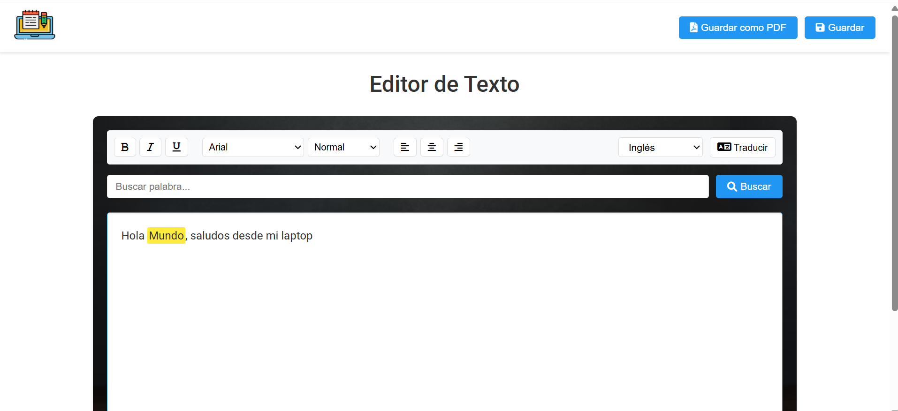

# 📝 Editor de Texto Traductor

Este proyecto es un **editor de texto interactivo y funcional** que incluye herramientas de edición, traducción automática y exportación. Ideal para practicar escritura, traducir texto en tiempo real y guardar tus notas en PDF.

---

## ✨ Características principales

- 🔍 **Buscador de texto** dentro del contenido escrito
- 🔤 **Traducción automática** usando la API de [MyMemory](https://mymemory.translated.net/)
- 🖋️ Estilos: **negrita**, *cursiva*, **cambio de tamaño de letra**
- 📤 Exportar como archivo PDF
- 🌙 Resalta la palabra buscada en el texto
- 
---

## 🚀 Tecnologías utilizadas

- HTML, CSS, JavaScript
- API MyMemory para traducción
- Librerías JS para manipular texto y exportar PDF (como `jsPDF`)

---

## 📸 Capturas

### 💻 Vista general del editor



---

## 🔧 Instalación y uso

```bash
git clone https://github.com/tuusuario/editor-texto-traductor.git
cd editor-texto-traductor
# Abre el archivo index.html directamente en tu navegador
